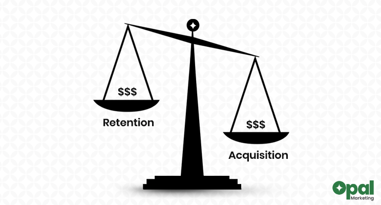

# Predicting Customer Churn

## Overview

At a fictitious bank in Europe, I worked on a project analyzing customer churn. We noticed that the bank was losing customers, and it seemed that this was having an effect on revenue. I was responsible for developing a model that predicts customers who are likely to leave in order to lower the overall cost of acquiring new customers to replace the ones that leave. When we were able to identify the customers who were likely to leave, the marketing team could create a focused customer retention program, which would lower the overall costs associated with customer acquisition and retention over time. The customers dataset that was downloaded from [kaggle](https://www.kaggle.com/shrutimechlearn/churn-modelling) contained labeled examples of customers who have left and those who still have open accounts, making the task a supervised learning classification task.

### Exploratory Data Analysis

10,000 client records are included in the dataset, and there are 13 columns that list the demographics and other information about the customers. No missing values or data type inconsistencies were found in the dataset, according to its properties. I used a heatmap to visualise the correlation between each feature in the dataset in order to determine whether there is a correlation between the features. The heatmap showed that all features, with the exception of "Age," which has the highest correlation cofficient of 0.29 with the target feature, have very low correlations with one another. I created a bar plot of the target feature to see the distribution of the number of customers who left and those who stayed. This revealed that roughly 8000 customers stayed and 2000 customers left, making the task an imbalanced classification task. Further analysis revealed that each class's features of credit score, age, and account balance are normally distributed with the exception of the feature of estimated salary, which is uniformly distributed.

### Model Building

Due to the non-linear relationship between the features in the dataset, I built the model using a decision tree classification algorithm. To ensure that the model is evaluated on a representative dataset, I used a stratified sampling technique to divide the dataset into training, validation, and test sets. I also used recall score as the primary performance metric for evaluating the model's performance because accuracy score would not fully describe how well the model predicts customers who are likely to leave. Recall seemed like the best metric to use because it measures how well the model does at detecting customers who are likely to leave, which was the project's primary goal.

I used a random oversampling method to balance the proportion of customers who left and those who stayed in order to address the training set's class imbalance. To evaluate how well the decision tree classifier performed, I used a baseline model with accuracy and recall scores of 0.8 and 0.0, respectively. I used a hyperparemeter tuning method to determine the best maximum depth for the tree in order to prevent the decision tree classifier from overfitting the dataset. On the test set, the best decision tree classifier had accuracy and recall scores of 0.78 and 0.76, respectively. I used ensemble methods to further improve the model's performance; this resulted in an increase in the accuracy and precision scores but a decrease in the recall score. Since recall was crucial to the aim the project, I decided that the optimised decision tree classifier is the best model for the project objective.

### Communicating Results

I created an interactive dashboard to communicate the model's performance to stakeholders. It displayed the model's evaluation metrics as well as the estimated cost of client acquisition and retention, and also the amount saved due to the model's precision for various probability thresholds on a test set. The best model saved 27,900 euros out of the 81,400 euros that would have been spent on client acquisition, assuming that customer acquisition and retention costs are 200 and 50 euros, respectively. The dashboard can be accessed via this [link](https://churnmetrics.herokuapp.com/).
